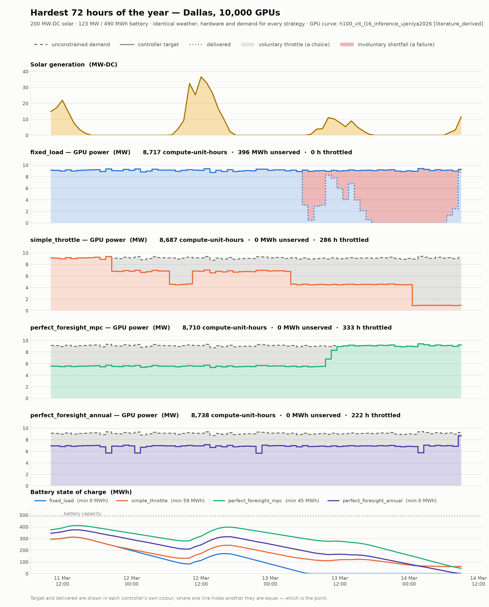
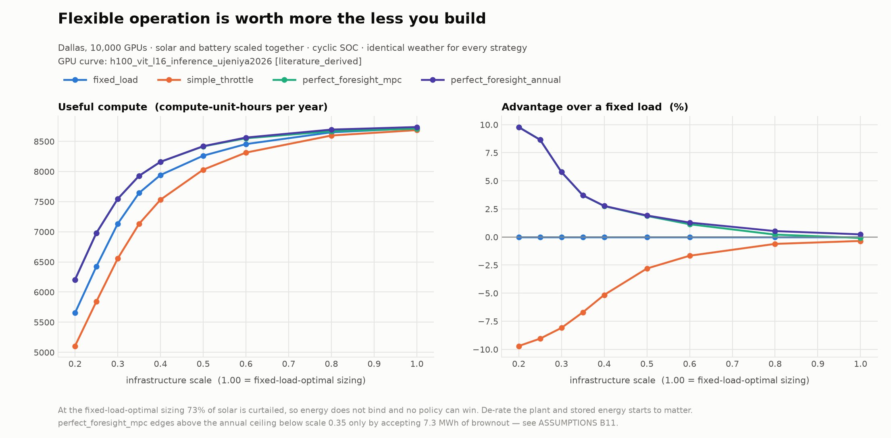
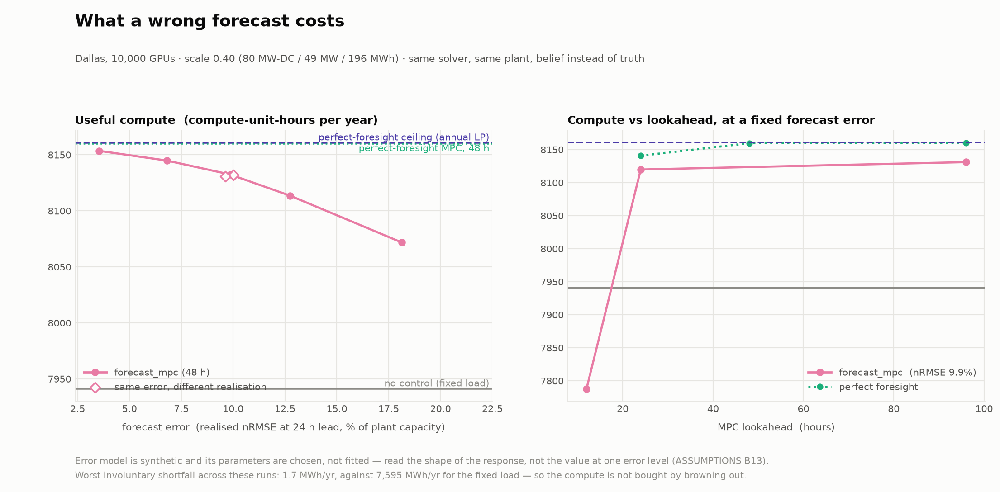

# Flexible Compute for Islanded AI Data Centres

**Research question:** how much can intelligent, forecast-aware GPU load control
reduce the solar + battery infrastructure required to produce a given amount of
useful compute in an islanded AI data centre?

The reference work this extends
([Newkirk et al.](https://github.com/acnewkirk/AI-Datacenter-Microgrid-Analysis),
vendored read-only in `upstream/`) treats the data centre as an **exogenous
hourly load** and optimises the supply side to meet a required uptime at minimum
cost. This project makes GPU demand a **control variable** and changes the
success metric from *uptime* to *useful compute produced*.

## Why this might matter

At the reproduced Dallas baseline (10,000 GPUs, 99% uptime, islanded
AC-coupled solar+BESS), the fixed-load architecture needs:

| | |
|---|---|
| IT load (average) | **9.13 MW** |
| Solar | **199.6 MW-DC** — 21.9× the average IT load |
| Battery | **122.6 MW / 490.3 MWh** |
| CAPEX | **$375 M** (2022 USD) |
| LCOE | **$0.439/kWh** |
| **Solar curtailed** | **73.5%** of everything generated |

Three quarters of the energy that the capital buys is thrown away, because the
system must be sized for the worst winter week while demand refuses to move.
That curtailed fraction is the headroom this project is trying to convert into
useful work.

> These figures use PVGIS TMY weather, not the paper's NSRDB data, and are not
> directly comparable to published results. See `ASSUMPTIONS.md` §B1.

## Status

**Experiment B has a first answer, and forecast error has now been priced.**
Four strategies run against identical weather, hardware and demand, on a
self-sustaining year, with battery power and energy priced and sized
independently. The LP planner's prediction matches the dispatcher to
**0.000000 compute-units**. The controller has since been re-run against a
*belief* rather than the truth, which is the test of whether any of this is
buildable — see [What if the forecast is wrong?](#what-if-the-forecast-is-wrong)
below. Still missing before the headline is quotable: forecast error applied to
**Experiment B's capital search** (the −7.8% remains a perfect-foresight
number), levelised cost rather than year-0 capital, and more than one
site-year. See `docs/ROADMAP.md`.

| | |
|---|---|
| `docs/ARCHITECTURE.md` | Phase 0 map of the reference model: how load, PUE, PV, dispatch, sizing and degradation actually work, with file:line references |
| `ASSUMPTIONS.md` | Every simplification, its status, and the open questions that threaten validity |
| `docs/ROADMAP.md` | Milestone plan |
| `results/` | Comparison output and figures |

### Experiment A — fixed infrastructure, four control policies

Same site, same year, same 200 MW-DC solar, same 123 MW / 490 MWh battery.
Only the decision policy differs.

| | compute | vs fixed | curtailed | unserved MWh | h throttled |
|---|---|---|---|---|---|
| `fixed_load` | 8717.45 | — | 73.44% | **396.1** | 0 |
| `simple_throttle` | 8686.61 | −0.354% | 73.63% | 0.0 | 286 |
| `perfect_foresight_mpc` (48 h) | 8709.77 | −0.088% | 73.58% | 0.0 | 333 |
| `perfect_foresight_annual` | **8737.74** | **+0.233%** | 73.44% | 0.0 | 222 |

**Even perfect foresight wins only 0.23% here — and that is the finding.** This
plant curtails 73% of its solar, so stored energy is not the binding
constraint and there is almost nothing for a controller to win. The value of
flexible operation is not extra compute from the same plant; it is *a smaller
plant for the same compute*. That is Experiment B.

Two upper bounds are reported because they answer different questions. The
annual LP is the true ceiling — one optimisation over all 8760 hours, no horizon
truncation, no terminal-value guesswork. The 48-hour receding-horizon MPC is
what that structure achieves with finite lookahead, and it is *worse than doing
nothing* at this sizing because its terminal value over-prices energy that is
about to be curtailed anyway. In the de-rated regime, where energy genuinely
binds, the same controller reaches 99.9% of the ceiling.



Read the figure top down: the sun nearly disappears for three days; `fixed_load`
holds full power, empties the battery, and spends most of the last two days in
involuntary shortfall (red); `simple_throttle` cuts power in crude SOC-triggered steps; the
MPC over-throttles early then over-corrects; the annual planner holds a nearly
constant ~7 MW, spending exactly the energy it has and no more.

### Where flexibility actually pays

Shrink solar and battery together and the picture inverts. Compute is shown with
unserved energy beside it, always — a policy can buy compute by browning out,
and the pair is the only honest read.

| scale | solar MW | batt MW | `fixed_load` | `simple_throttle` | `mpc` (48 h) | `annual` |
|---|---|---|---|---|---|---|
| 1.00 | 199.6 | 122.6 | 8717 / 396 | 8687 / 0 | 8710 / 0 | **8738 / 0** |
| 0.80 | 159.7 | 98.1 | 8650 / 1030 | 8597 / 0 | 8668 / 0 | **8695 / 0** |
| 0.60 | 119.7 | 73.5 | 8455 / 2831 | 8313 / 0 | 8550 / 0 | **8563 / 0** |
| 0.50 | 99.8 | 61.3 | 8262 / 4608 | 8030 / 0 | 8416 / 0 | **8420 / 0** |
| 0.40 | 79.8 | 49.0 | 7941 / 7595 | 7532 / 0 | 8160 / 0 | **8161 / 0** |
| 0.30 | 59.9 | 36.8 | 7134 / 15126 | 6556 / 22 | 7545 / 7 | **7546 / 0** |
| 0.20 | 39.9 | 24.5 | 5653 / 28655 | 5104 / 276 | 6206 / 7 | **6205 / 0** |

*(compute-unit-hours / MWh unserved)*



The perfect-foresight advantage grows from **+0.23% at full size to +9.8% at
one-fifth the plant**. Read the other way — the question Experiment B will ask
properly — matching a fixed load's compute takes roughly **10–13% less
solar+BESS capacity** under perfect foresight, across every target tested:

| compute target | `fixed_load` needs | `annual` needs | |
|---|---|---|---|
| 8717 (fixed @ 1.00) | 1.00 | 0.904 | **−9.6%** |
| 8455 (fixed @ 0.60) | 0.60 | 0.524 | **−12.6%** |
| 7941 (fixed @ 0.40) | 0.40 | 0.353 | **−11.8%** |

Interpolated between sampled scales and **not yet a defensible headline number**
— it holds solar/battery ratio and duration fixed, uses a linear-cooling model
that over-credits throttling (`ASSUMPTIONS` Q3), and prices no capital. Treat it
as an indication of magnitude.

`simple_throttle` is *worse* than doing nothing at every sizing, and gets worse
as the plant shrinks. It throttles on SOC alone, so it cuts power on days that
would have been fine. The gap between it and the MPC — 19.5 percentage
points at scale 0.20 — is the value of knowing *when* to throttle.

One caveat visible in the table: below scale 0.35 the MPC's compute edges past
the annual ceiling, but only by accepting ~7 MWh of brownout. It is not a better
policy, and the shortfall column is what stops that reading. The cause is the
year boundary — the receding horizon truncates at 31 December, so the MPC ends
the year empty and cannot power an idle fleet through the first January night.
See `ASSUMPTIONS` B11.

### How far ahead does it need to see?

This one has a practical answer, and it is encouraging.

| lookahead | scale 1.00 (over-built) | | scale 0.40 (where it matters) | |
|---|---|---|---|---|
| | compute | % of ceiling | compute | % of ceiling |
| 24 h | 8654.2 (−0.73%) | 99.04% | 8140.7 (+2.51%) | **99.75%** |
| 48 h | 8709.8 (−0.09%) | 99.68% | 8159.6 (+2.75%) | **99.99%** |
| 96 h | 8728.7 (+0.13%) | 99.90% | 8160.4 (+2.76%) | **100.00%** |
| annual LP | 8737.7 (+0.23%) | 100% | 8160.8 (+2.77%) | 100% |

Monotone in horizon, as it must be. At the over-built sizing a two-day horizon
is not enough to beat doing nothing — the March drought outlasts it — and four
days is.

**In the regime that matters the horizon barely matters at all:** 24 hours of
lookahead already captures 99.75% of what infinite foresight is worth, and 48
hours captures 99.99%.

> **Read that column carefully — it flatters short horizons.** "% of ceiling"
> divides by a number that is only 2.77% above doing nothing, so every entry is
> pinned near 100%. Measured against the *advantage* — the 219.6 compute-units
> that separate no control from the ceiling — 24 hours captures **90.8%**, not
> 99.75%, and 48 hours captures 99.5%. Both framings are arithmetically correct;
> the second is the one that answers "how much of the prize does this horizon
> win?", and it is the framing used from here on.

Either way the practical conclusion holds: a deployable controller needs a good
one-to-two-day solar forecast, not a great seasonal one. What that claim was
missing is that it was measured with a *perfect* 24-hour forecast — which is
the next section.

### What if the forecast is wrong?

Every number above consumes the realised future, which makes them a ceiling
rather than a design. This section replaces the truth with a **belief**: same
controller, same solver, same plant, identical weather — only the information
changes. `PerfectForesightMPCController` now refuses any forecast
that could be wrong, so the two cannot be confused, and a test requires the two
controllers to choose **bit-identical** actions when handed the same belief.
Any gap below is therefore attributable to information and nothing else.

The error model (`ASSUMPTIONS` B13) scales error by each hour's **clear-sky
potential** rather than by realised output — otherwise the forecast would be
exactly right during every multi-day drought, which are the events that size
an islanded plant. Error grows as √(lead time), persists on weather timescales,
and is zero at lead 0. `sigma_24h = 0.15` lands at **9.9% nRMSE of capacity at
day-ahead lead**, roughly what single-site day-ahead forecasting achieves.

At scale 0.40, where stored energy binds. Perfect foresight is worth +219.6
compute-units over no control; "retained" is the share of *that* which survives:

| forecast | nRMSE @ 24 h | compute | unserved MWh | advantage retained |
|---|---|---|---|---|
| perfect foresight (annual LP) | — | 8160.8 | 0.0 | 100% (ceiling) |
| perfect foresight, MPC 48 h | — | 8159.6 | 0.0 | 99.5% |
| excellent | 3.5% | 8153.5 | 0.0 | 96.7% |
| good | 6.8% | 8144.8 | 0.1 | 92.7% |
| **realistic day-ahead** | **9.9%** | **8132.4** | **0.1** | **87.1%** |
| mediocre | 12.7% | 8113.5 | 0.1 | 78.5% |
| poor | 18.1% | 8071.8 | 0.1 | 59.5% |
| no control (fixed load) | — | 7941.2 | 7594.8 | 0% |



**At realistic day-ahead skill the controller keeps 87% of what perfect
foresight was worth.** The advantage of forecast-aware control is not an
artefact of knowing the future — most of it survives not knowing.

Four things qualify that, and the last one matters most.

- **The degradation accelerates.** Retention falls 9.6 points across the first
  6.4 points of nRMSE (3.5% → 9.9%), then 27.6 points across the next 8.2
  (9.9% → 18.1%). Today's skill sits on the flat part of the curve, but the
  margin above the knee is thinner than a linear read suggests: a forecast
  twice as bad as current practice loses roughly 40% of the prize.
- **It is not one lucky draw.** Three independent error realisations at the
  same level give 8132.4 / 8132.0 / 8130.9 — a spread of 1.5 compute-units
  against a 219.6 window, so 0.7 percentage points of retention.
- **It is not bought by browning out.** Worst involuntary shortfall across
  every run here is 1.7 MWh/yr, against 7,594.8 MWh/yr for the fixed load. The
  column is reported because a controller *can* buy compute with brownouts
  (`ASSUMPTIONS` B11); here it did not.
- **This re-prices Experiment A's compute, not Experiment B's capital.** The
  −7.8% saving attributed to control below is still a perfect-foresight number.
  Re-running the sizing search under forecast error means hundreds of simulated
  MPC-years, and it has not been done — so 87% retention must not be quietly
  multiplied through to −6.8%. It is on the roadmap as open.

At the over-built sizing the picture inverts, as it must: with 73% of solar
curtailed, information about the future is nearly worthless, and forecast error
costs almost nothing because there was almost nothing to lose (8709.8 → 8702.1
at realistic skill, −0.09%). The retention metric is meaningless there — the
perfect-foresight MPC is itself *worse* than doing nothing (`ASSUMPTIONS` B10).

#### Lookahead, once the lookahead is wrong

The horizon result above was measured with a perfect forecast. Re-run at 9.9%
nRMSE, longer lookahead now buys more foresight and more error at the same time:

| lookahead | perfect foresight | | forecast-aware | | |
|---|---|---|---|---|---|
| | compute | retained | compute | retained | unserved MWh |
| 12 h | 7802.6 | −63.1% | 7788.1 | −69.7% | 15.7 |
| 24 h | 8140.7 | 90.8% | 8119.8 | 81.3% | 0.1 |
| 48 h | **8159.6** | **99.5%** | **8132.4** | **87.1%** | 0.1 |
| 96 h | 8160.4 | 99.8% | 8131.0 | 86.5% | 0.1 |

**Under perfect foresight the curve is monotone in horizon; under error it
peaks at 48 hours and turns down.** Past two days the forecast has decayed
toward climatology, so the extra lookahead adds error faster than information.
The effect is small — 1.4 compute-units from 48 h to 96 h — but it is the
right sign, and it means "longer horizon is always safer" stops being true the
moment the horizon is a belief.

The 12-hour collapse is *not* a forecast failure: perfect foresight fails there
too (7802.6, also below no control, with 18.7 MWh unserved). A half-day horizon
cannot see across a night to the next day's generation, so the controller
spends into a morning it cannot verify is coming. That is a horizon pathology,
and forecast error adds only 14.5 compute-units on top of it.

### Experiment B — minimum capital for equal compute

Every design must deliver the same annual compute as the reference plant
(8717.45 compute-unit-hours). Solar MW, battery MW and battery *duration* are
searched independently, priced with storage split into $/kW and $/kWh.

| design | CAPEX | vs ref | solar MW | batt MW | batt MWh | duration | unserved |
|---|---|---|---|---|---|---|---|
| reference (sized for 99% uptime) | 376.0 M$ | — | 199.6 | 122.6 | 490 | 4.0 h | 396 |
| `fixed_load`, re-sized | 291.7 M$ | −22.4% | 126.0 | 53.4 | 731 | 13.7 h | 395 |
| `simple_throttle` | 325.0 M$ | −13.6% | 139.6 | 63.2 | 811 | 12.8 h | **0** |
| `perfect_foresight_annual` | **269.0 M$** | **−28.5%** | 121.8 | 45.6 | 638 | 14.0 h | **0** |

**Most of that saving is not about control.** The decomposition matters more
than the headline:

| effect | |
|---|---|
| changing the metric — 99% uptime → delivered compute, fixed load re-sized | **−22.4%** |
| flexible operation on top of that | **−7.8%** |
| total | −28.5% |

Sizing a plant for a 99%-uptime tail is expensive, and simply *measuring the
right thing* recovers most of the cost. Quoting −28.5% as the value of
forecast-aware control would overstate it by roughly a factor of three.

Three further things the table says:

- **Nobody wants a 4-hour battery.** Every optimised design lands near 13–15
  hours, with far less battery *power* (46–63 MW vs 122.6) and more *energy*
  (638–820 MWh vs 490). An islanded solar plant needs to ride through multi-day
  droughts, not deliver peaks. Upstream's fixed 4-hour coupling was hiding this.
- **The flexible design is also more reliable.** At equal compute the re-sized
  fixed load still browns out for 395 MWh a year; the flexible designs deliver
  every watt they ask for. So the comparison is *not* reliability-matched — it
  is unmatched in the flexible design's favour, and a reliability-constrained
  re-run is on the roadmap.
- **`simple_throttle` costs more than doing nothing** (+11.4% over the re-sized
  fixed load), consistent with every other experiment here.

Repeating the whole thing with 30% of cooling made non-sheddable
(`--cooling-fixed-fraction 0.30`) moves the total from −28.5% to −28.5%, and
the control share from −7.8% to −7.5%. The result is not an artefact of the
linear-cooling assumption.

> **This is an upper bound.** It uses perfect foresight, year-0 capital only (no
> O&M, replacement, degradation or discounting), one weather year, one site, and
> a GPU curve that is literature-derived rather than measured. It is a magnitude,
> not a quotable figure.
>
> The forecast-error sweep above shows 87% of the *compute* advantage surviving
> realistic day-ahead skill, which is the reason to think −7.8% is reachable
> rather than fictional. It is **not** a licence to restate it as −6.8%: that
> conversion needs the capital search itself re-run under forecast error, which
> has not been done.

## Setup

```bash
git clone https://github.com/acnewkirk/AI-Datacenter-Microgrid-Analysis.git upstream
python3 -m venv .venv && .venv/bin/pip install -r requirements.txt
```

Weather comes from PVGIS by default — no API key, no account. To use the
reference paper's NSRDB PSM4 source instead, get a free key at
<https://developer.nlr.gov/signup/> and:

```bash
export NLR_API_KEY=... NLR_EMAIL=...
python scripts/run_baseline.py --weather-source nsrdb
```

## Usage

```bash
python scripts/run_baseline.py                   # build + optimise + write snapshot
python scripts/run_baseline.py --check           # verify nothing has drifted
python scripts/run_baseline.py --skip-optimizer  # fast path, probes only
python scripts/run_baseline.py --location phoenix
python scripts/run_experiment_a.py               # four strategies + figure
python scripts/run_experiment_a.py --derate-sweep  # + shrink the plant
python scripts/run_experiment_a.py --fast        # skip the MPC (seconds)
python scripts/run_horizon_sweep.py              # how far ahead must it see?
python scripts/run_forecast_sweep.py             # what if the forecast is wrong?
python scripts/run_experiment_b.py               # minimum capital for equal compute
python -m pytest                                 # project tests
cd upstream && python -m pytest tests/           # reference model's own tests
```

First run fetches weather (a few seconds) and caches it under `data/weather/`.
Every run after that is fully offline and deterministic.

## Design rules

These are constraints on the work, not aspirations.

1. **`upstream/` is never modified.** It is a vendored read-only dependency.
   Everything is built around it. `tests/test_upstream_invariants.py` pins the
   behaviours we rely on, so an upstream update that breaks an assumption fails
   loudly instead of silently changing results.
2. **The fixed-load result is an invariant.** Adding controllers must leave the
   baseline numbers bit-identical. `baselines/*.json` plus
   `tests/test_baseline_snapshot.py` enforce it.
3. **Physics is tested, not trusted.** Every simulation is audited for energy
   conservation, SOC bounds and power limits. The audit already caught a real
   sizing/simulation mismatch in the reference optimiser — see
   `ASSUMPTIONS.md` A13.
4. **Controllers cannot see the future by accident.** `Observation` carries
   scalars describing *now* and nothing else — enforced by a test. Forecast data
   reaches a controller only through an explicit `SolarForecast` object, so
   perfect foresight is an opt-in dependency rather than a leak. Since
   Milestone 6 the label is enforced too: `PerfectForesightMPCController`
   rejects any forecast that could be wrong, so a perfect-foresight result
   cannot be produced by a run labelled otherwise, or vice versa.
5. **GPU performance data carries its provenance.** Every curve declares whether
   it is `synthetic`, `literature_derived` or `measured`, cites its source, and
   refuses to extrapolate below the power range that source actually covers.
   The kind travels with every result.
6. **The optimiser and the simulator must agree.** The MPC plans against a
   second, independent model of the plant, so a test requires the LP's predicted
   compute to equal the dispatcher's measured compute for the same schedule.
   Currently exact to 0.000000 compute-units.
7. **The year must be self-sustaining.** Every comparison enforces
   end-of-year SOC = start-of-year SOC by fixed-point iteration, so no strategy
   is credited with energy nobody generated.
8. **Assumptions are labelled, and assumptions that favour our hypothesis are
   labelled loudest.** See `ASSUMPTIONS.md` §5, "Threats to validity".

## Repository layout

```
upstream/               vendored reference model (read-only)
src/flexcompute/
  upstream_bridge.py    import/path plumbing for the vendored model
  weather.py            TMY providers (PVGIS / NSRDB) + local-time normalisation
  scenario.py           Scenario -> Site: the shared, controller-independent world
  baseline.py           fixed-load runs and seeded sizing optimisation
  metrics.py            metric extraction + energy-conservation audit
  snapshot.py           reproducibility contract
  gpu.py                power-performance curves, with provenance
  control.py            ComputeController protocol + heuristic controllers
  dispatch.py           closed-loop simulator (+ cyclic SOC boundary)
  forecast.py           SolarForecast protocol; perfect and noisy forecasts
  mpc.py                LP planner, annual ceiling, receding-horizon MPC
                        (perfect-foresight and forecast-aware)
  costs.py              capital cost model, storage split $/kW and $/kWh
  experiments.py        Experiment A + B harness (comparability guarantee)
  plotting.py           figures
scripts/               CLIs
results/                comparison output and figures
baselines/              committed snapshots
data/weather/           cached TMY (git-ignored)
tests/                  project tests
docs/                   architecture map and roadmap
```

## Licence

MIT, matching the reference project.
