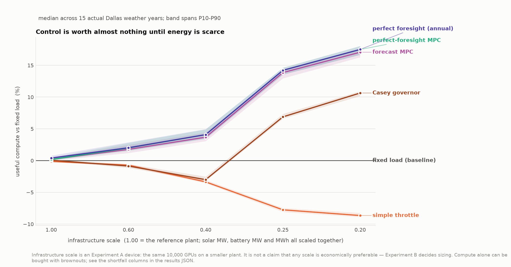
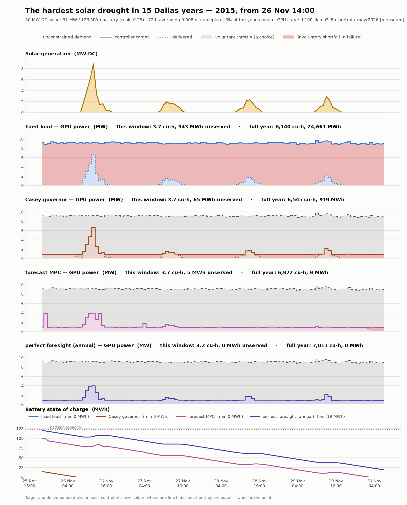
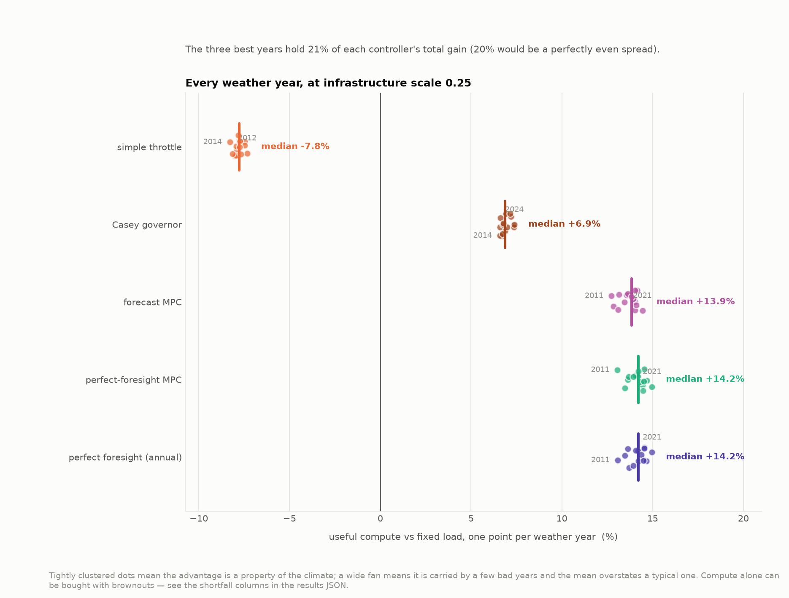
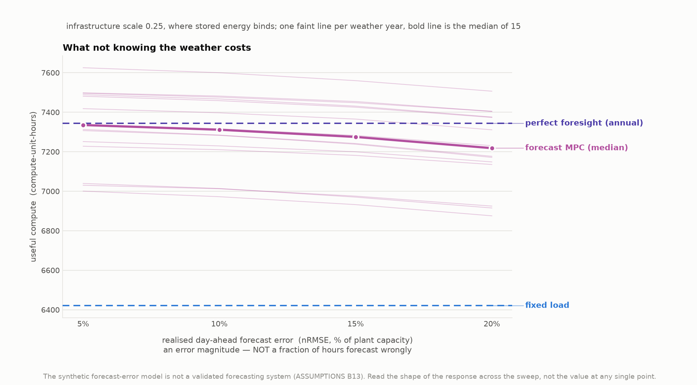

# Flexible Compute for Islanded AI Data Centers

**Research question:** how much can intelligent, forecast-aware GPU load control
reduce the solar + battery infrastructure required to produce a given amount of
useful compute in an islanded AI data centre?

The reference work this extends
([Newkirk et al.](https://github.com/acnewkirk/AI-Datacenter-Microgrid-Analysis),
vendored read-only in `upstream/`) treats the data centre as an **exogenous
hourly load** and optimises the supply side to meet a required uptime at minimum
cost. This project makes GPU demand a **control variable** and changes the
success metric from *uptime* to *useful compute produced*.

## Why this might matter

At the reproduced Dallas baseline (10,000 GPUs, 99% uptime, islanded
AC-coupled solar+BESS), the fixed-load architecture needs:

| | |
|---|---|
| IT load (average) | **9.13 MW** |
| Solar | **199.6 MW-DC** — 21.9× the average IT load |
| Battery | **122.6 MW / 490.3 MWh** |
| CAPEX | **$375 M** (2022 USD) |
| LCOE | **$0.439/kWh** |
| **Solar curtailed** | **73.5%** of everything generated |

Three quarters of the energy that the capital buys is thrown away, because the
system must be sized for the worst winter week while demand refuses to move.
That curtailed fraction is the headroom this project is trying to convert into
useful work.

> These figures use PVGIS TMY weather, not the paper's NSRDB data, and are not
> directly comparable to published results. See `ASSUMPTIONS.md` §B1.

## Status

**The study now runs on fifteen actual Dallas weather years and a directly
measured H100 LLM-training curve.** Six control policies, from doing nothing to
perfect foresight, against identical weather, hardware and demand, on a
self-sustaining year. The LP planner's prediction still matches the dispatcher
to **0.000000 compute-units**.

Three inputs changed, and two of them moved the answer:

| | before | now |
|---|---|---|
| GPU curve | ViT-L/16 inference, throughput inferred from SM clock | **LLaMA 3 8B pre-training, throughput measured** (`arXiv:2603.16164`) |
| weather | one PVGIS TMY | **15 actual years, 2010–2024** (ERA5, cross-checked against NSRDB) |
| forecast error | indexed by the model's internal sigma | **indexed by realised day-ahead nRMSE**, calibrated per year |

Along the way a real defect surfaced in the inherited PV model: it renormalised
every year by that year's own peak hour, inflating cloudy years by up to 9.4%
and **reordering which year looked sunniest**. Any multi-year result computed
before that fix is invalid. See `ASSUMPTIONS.md` B16.

Still open: levelised cost rather than year-0 capital, a second site, and
Experiment B across all fifteen years rather than a representative one.
See `docs/ROADMAP.md`.

| | |
|---|---|
| `docs/ARCHITECTURE.md` | Phase 0 map of the reference model: how load, PUE, PV, dispatch, sizing and degradation actually work, with file:line references |
| `ASSUMPTIONS.md` | Every simplification, its status, and the open questions that threaten validity |
| `docs/ROADMAP.md` | Milestone plan |
| `results/` | Comparison output and figures |

### The comparison ladder

Six policies, differing only in **what the controller is allowed to know**:

| rung | knows | |
|---|---|---|
| `fixed_load` | nothing — demand is exogenous | the reference model |
| `simple_throttle` | battery SOC | deliberately naive |
| `casey_governor` | SOC + clock + present generation | **no weather forecast** |
| `forecast_mpc` | a day-ahead forecast that can be wrong | the deployable design |
| `perfect_foresight_mpc` | the realised future, 48 h at a time | upper bound |
| `perfect_foresight_annual` | the realised future, all 8760 h | the ceiling |

`casey_governor` reimplements the governor described in
[Casey Handmer's *Direct Current Data Centers*](https://caseyhandmer.wordpress.com/2026/01/30/direct-current-data-centers/):
ration the battery over the hours until the sun returns, and throttle early
rather than run flat out into a wall. It is the last rung a real operator could
build with no forecast at all, so **the step from it to `forecast_mpc` is the
value of weather forecasting**, and the step from `fixed_load` to it is the
value of merely reacting to stored energy. Everything we had to invent to turn
four sentences of prose into code is recorded in `ASSUMPTIONS.md` B14.

### Experiment A — same plant, fifteen real weather years

Median across 2010–2024, with involuntary shortfall printed beside compute
**always** — a policy can score well on compute purely by browning out, and in
the middle of this table one does.

| scale | | `fixed_load` | `simple_throttle` | `casey_governor` | `forecast_mpc` | `pf_annual` |
|---|---|---|---|---|---|---|
| 1.00 | compute | 8709 | 8702 | 8716 | 8721 | **8744** |
| | vs fixed | — | −0.14% | +0.05% | +0.18% | **+0.40%** |
| | shortfall | 473 | 0 | 9 | 0 | 0 |
| 0.60 | compute | 8440 | 8386 | 8347 | 8588 | **8607** |
| | vs fixed | — | −0.72% | −0.87% | +1.76% | **+2.02%** |
| | shortfall | 3013 | 0 | 83 | 0 | 0 |
| 0.40 | compute | 7965 | 7702 | 7742 | 8263 | **8290** |
| | vs fixed | — | −3.36% | −3.01% | +3.68% | **+4.08%** |
| | shortfall | 7490 | 0 | 216 | 0 | 0 |
| 0.25 | compute | 6420 | 5920 | 6880 | 7311 | **7343** |
| | vs fixed | — | −7.76% | **+6.88%** | **+13.85%** | **+14.21%** |
| | shortfall | 22169 | 65 | 762 | 4 | 0 |
| 0.20 | compute | 5634 | 5158 | 6234 | 6597 | **6627** |
| | vs fixed | — | −8.66% | **+10.64%** | **+17.06%** | **+17.50%** |
| | shortfall | 29427 | 228 | 927 | 9 | 0 |

*(compute-unit-hours; shortfall in MWh/yr; medians of 15 years)*



Three things this says.

**Control is worth almost nothing until energy is scarce.** At the
fixed-load-optimal sizing the plant curtails ~72% of its solar and even perfect
foresight wins +0.40%. The value of flexible operation is not extra compute from
the same plant; it is *a smaller plant for the same compute*. That is
Experiment B.

**Read the 0.40 and 0.60 rows carefully — and read the shortfall column with
them.** `fixed_load` beats both forecast-free heuristics on compute there while
booking 3,000–7,500 MWh/yr of involuntary shortfall against their 83–216. Two
readings were plausible and we tested which is right:

- *Is it an artefact of partial brownout credit?* The fleet-aggregation
  assumption (`ASSUMPTIONS` B8) gives a browning-out plant partial compute
  credit. **No — we checked.** Re-run under `per_device` aggregation, which
  removes that credit, `fixed_load` moves by 0.2% and `casey_governor` gets
  *slightly worse* (−3.19% → −3.67% at scale 0.40). The ranking is robust.
- *Is the governor genuinely over-cautious here?* **Yes.** With no forecast it
  must ration against the possibility that tomorrow is also dark, and in this
  range that costs more compute than the brownouts it avoids.

So this is a real limitation of forecast-free control, not a scoring trick. What
the compute column *cannot* say is whether the trade is worth it: it assigns no
penalty at all to 7,500 MWh of unserved load. Pricing that is exactly what
Experiment B's reliability-matched variant does.

**A forecast is worth roughly half the prize, and Casey's governor gets the
other half.** At scale 0.25, of the 14.21 points perfect foresight is worth,
the forecast-free governor captures 6.88 (48%) and the realistic forecast-aware
MPC captures 13.85 (**97%**). Everything above `casey_governor` is what
knowing the weather buys.

### The mechanism, on the hardest weather in the record



The worst 72-hour solar drought in all fifteen years: **26 November 2015**,
averaging 0.8% of nameplate for three days.

**Read the bottom panel first — it is the whole story.**
`perfect_foresight_annual` and `forecast_mpc` entered the drought with 122 and
100 MWh in the battery because they *saw it coming*. `casey_governor` entered
with 15 MWh, because it cannot see past the next sunrise. Its rationing
*during* the drought is as disciplined as the optimum's — the two power traces
are nearly the same shape — but it started with nothing to ration.

The four power panels make the same point a second way. Inside this window all
four policies produce almost identical compute (3.7 / 3.7 / 3.7 / 3.2
compute-unit-hours): when the sun is this far gone, nobody computes much. What
differs by two orders of magnitude is **unserved load** — 943 / 65 / 5 / 0 MWh.
The fixed load is one solid block of red for five days.

So the value of a forecast here is not better behaviour during the emergency. It
is having charged up before it, and the difference shows up as reliability
rather than as throughput.

### Is the advantage consistent, or carried by a few bad years?



**Consistent.** At scale 0.25 the three best years hold 21% of each controller's
total gain, against 20% for a perfectly even spread, and every one of the
fifteen years shows a positive advantage for `casey_governor`, `forecast_mpc`
and `perfect_foresight_annual`. This is a property of the Dallas climate, not
of two unlucky winters.

That is worth stating because the opposite was the obvious prior, and because
the weather data says the years genuinely differ: capacity factor ranges 0.229
(2015) to 0.258 (2011), and the worst 72-hour drought ranges from 0.008 to 0.056
of nameplate — a **sevenfold** spread. Notably, **annual sunniness barely
predicts drought severity** (correlation +0.46), so no single "representative"
year would have been defensible.

### How far ahead does it need to see?

At scale 0.25, where stored energy binds. Perfect foresight is worth 893
compute-unit-hours over no control; "retained" is the share of *that* which a
finite horizon keeps. Median of three years spanning the record — the drought
year (2015), a mid-pack year (2019) and the sunniest (2022).

| lookahead | perfect foresight | | forecast-aware (10% nRMSE) | | unserved MWh |
|---|---|---|---|---|---|
| | compute | retained | compute | retained | |
| 12 h | 7169 | 92.4% | 7156 | 91.0% | 116.6 |
| 24 h | 7229 | 99.1% | **7216** | **97.6%** | 14.7 |
| 48 h | 7236 | 99.9% | 7210 | 97.0% | 1.0 |
| 96 h | 7237 | 100.0% | 7208 | 96.7% | 0.7 |
| annual LP | 7237 | 100% | — | — | 0.0 |

> **Retained-of-advantage, not percent-of-ceiling.** Dividing by the ceiling
> pins every entry near 100%, because the ceiling is only ~14% above doing
> nothing. This column answers "how much of the prize does this horizon win?"

**Under perfect foresight the curve is monotone in horizon, as it must be.
Under forecast error it peaks at 24 hours and turns down.** Past a day the
forecast has decayed toward climatology, so extra lookahead adds error faster
than information. The effect is small — 0.9 points from 24 h to 96 h — but it
has the right sign, and it means "a longer horizon is always safer" stops being
true the moment the horizon is a belief.

The practical conclusion is unchanged and encouraging: **a deployable controller
needs a good one-day solar forecast, not a great seasonal one.** A 12-hour
horizon is the one to avoid — it cannot see across a night to the next day's
generation, and both the perfect and the forecast-aware runs lose ~8 points and
book two orders of magnitude more unserved energy there. That is a horizon
pathology, not a forecasting one.


### What if the forecast is wrong?

Every foresight number above consumes the realised future, which makes it a
ceiling rather than a design. This section replaces the truth with a **belief**:
same controller, same solver, same plant, identical weather — only the
information changes. `PerfectForesightMPCController` refuses any forecast that
could be wrong, and a test requires the two controllers to choose bit-identical
actions when handed the same belief, so any gap is attributable to information
and nothing else.

The sweep is indexed by **realised day-ahead nRMSE**, not by the error model's
internal sigma. That matters across years: the same sigma lands at 9.5–10.5%
realised error depending on the year's cloud cover, so a sigma-indexed sweep
would compare different error levels while labelling them the same. Each year is
calibrated independently.

> **nRMSE is an error magnitude, not a failure rate.** "10% forecast error"
> means the RMS error is 10% of plant capacity. It does **not** mean the
> forecast is wrong 10% of the time.

At scale 0.25, where stored energy binds. Perfect foresight is worth +923
compute-unit-hours over no control; "kept" is the share of *that* which survives:

| realised day-ahead nRMSE | compute | vs fixed | advantage kept | shortfall MWh |
|---|---|---|---|---|
| perfect foresight (ceiling) | 7343 | +14.38% | 100% | 0.0 |
| 5% | 7335 | +14.25% | **99.1%** | 1.4 |
| **10% (reference)** | **7311** | **+13.88%** | **96.5%** | 4.2 |
| 15% | 7275 | +13.31% | 92.6% | 9.1 |
| 20% | 7218 | +12.42% | 86.4% | 16.1 |
| no control | 6420 | — | 0% | 22169 |



**At realistic day-ahead skill the controller keeps 96.5% of what perfect
foresight was worth**, and every one of the fifteen years shows the same gentle
slope. The response is close to linear across the whole 5–20% range, with no
knee inside it.

That is a markedly better result than the same experiment gave on a single TMY
with the old GPU curve (87% retention), and the improvement is *not* a
correction of an error — it comes from the two input changes. Both are declared:
the LLM-training curve makes throttling cheaper in lost work than the ViT curve
did, and real weather years contain deeper, better-signposted droughts than a
TMY does.

Three qualifications, and the last one matters most.

- **It is not bought by browning out.** Worst shortfall in the sweep is 16 MWh/yr
  against 22,169 MWh/yr for the fixed load. The column is printed because a
  controller *can* buy compute with brownouts (`ASSUMPTIONS` B11); here it did
  not.
- **The error model is still synthetic.** Its structure is defensible and its
  two biases are declared — successive forecasts converge monotonically on the
  truth (optimistic), error never averages away across re-plans (pessimistic) —
  but the parameters are chosen to land near published skill, not fitted to a
  measured error series. Read the *shape* of the response, not the value at one
  point. See `ASSUMPTIONS` B13.
- **Only solar is uncertain.** A real controller mis-forecasting a hot day gets
  generation *and* cooling load wrong together, in the same direction. The
  planner is still handed future PUE and demand exactly (`ASSUMPTIONS` B9).

### Experiment B — minimum capital for equal compute

Every design must deliver the same annual compute as the reference plant, on the
same weather year. Solar MW, battery MW and battery *duration* are searched
independently, priced with storage split into $/kW and $/kWh. Dallas 2019.

Two variants, because the first one is not quite a fair fight:

- **B1 — equal compute only.** A design may hit its compute target partly by
  browning out, and the re-sized fixed-load plant does.
- **B2 — equal compute *and* equal reliability.** Annual involuntary shortfall
  must also stay under a cap applied identically to everyone. The cap is what
  the reference 99%-uptime plant *itself* books under a fixed load — derived
  from the fixed-load design's own behaviour, not from the flexible ones, so it
  cannot favour flexibility by construction (`ASSUMPTIONS` B18).

#### The answer at free duration

| design | CAPEX | vs reference | vs re-sized fixed load | solar MW | batt MW | batt MWh | duration | shortfall |
|---|---|---|---|---|---|---|---|---|
| reference (sized for 99% uptime) | 376.0 M$ | — | — | 199.6 | 122.6 | 490 | 4.0 h | 441 |
| `fixed_load`, re-sized | 278.0 M$ | −26.1% | — | 115.4 | 51.7 | 734 | 14.2 h ! | 433 |
| `casey_governor` | 274.1 M$ | −27.1% | **−1.4%** | 117.2 | 53.6 | 688 | 12.8 h ! | 9 |
| `forecast_mpc` | *(searching)* | | | | | | | |
| `perfect_foresight_annual` | **235.0 M$** | **−37.5%** | **−15.5%** | 98.8 | 49.0 | 595 | 12.1 h ! | **0** |

`!` marks a duration outside the 2–10 h range the battery cost split is sourced
over — those figures extrapolate it (`ASSUMPTIONS` B19).

**B1 and B2 give the same answer.** The re-sized fixed-load plant lands at 433
MWh against a 441 MWh cap, so the reliability constraint almost never binds;
where it does (the fixed-12 h case, which drifts to 452 MWh under B1) it costs
+0.1 M$ to pull back. **The reliability mismatch that motivated B2 is real,
measurable, and worth about a tenth of a percent of capital.** That is a
stronger result than either variant alone: the earlier caveat was justified, and
removing it does not change the conclusion.

#### Where the saving comes from

| effect | |
|---|---|
| changing the metric — 99% uptime → delivered compute, fixed load re-sized | **−26.1%** |
| perfect-foresight flexible operation on top of that | **−15.5%** |
| what a forecast-free governor adds on its own | **−1.4%** |

Sizing a plant for a 99%-uptime tail is expensive, and simply *measuring the
right thing* still recovers most of the cost. Quoting the −37.5% total as the
value of flexible control would overstate it by roughly a factor of two.

**The previous ~7–8% figure did not survive — it roughly doubled.** On the
measured LLM-training curve, perfect-foresight control is worth **−15.5%** of
solar+BESS capital against a re-sized fixed load, not −7.8%. The change is not
a correction of an arithmetic error; it is the GPU curve. LLM training gives up
less throughput per watt than the ViT-inference proxy did (0.708 vs 0.624
compute at half power), so throttling buys more. Roughly half of that shift is
attributable to the power-cap axis rather than the workload, which is why the
draw-axis sensitivity curve exists and why any quote of −15.5% must be
accompanied by it.

#### Battery duration is not what the advantage rests on

| duration | `fixed_load` | `casey_governor` | `perfect_foresight_annual` | control advantage |
|---|---|---|---|---|
| 4 h | 327.2 M$ | 320.9 M$ | 274.5 M$ | −16.1% |
| 8 h | 290.1 M$ | 283.4 M$ | 244.8 M$ | −15.6% |
| 12 h ! | 278.8 M$ | 272.5 M$ | 234.9 M$ | −15.7% |
| free (12–14 h) ! | 278.0 M$ | 274.1 M$ | 235.0 M$ | −15.5% |

Two separate readings, and only one of them is safe.

- **The control advantage is flat in duration** — −15.5% to −16.1% across the
  whole range, including the 8-hour row which is *inside* the cost model's
  sourced range. The headline does not depend on extrapolation.
- **The absolute capital is not.** Forcing 4-hour storage costs 15–17% more than
  letting duration float. So "nobody wants a 4-hour battery" reproduces — but
  every free-duration optimum sits at 12–15 h, outside the 2–10 h range the
  $/kW + $/kWh split is derived from, and that preference must **not** be quoted
  as an economic finding about real batteries until the cost decomposition is
  sourced over that range.

> **This is still an upper bound.** Year-0 capital only — no O&M, no battery
> replacement, no degradation, no discounting — on one weather year, one site,
> and a curve whose power axis is a configured cap rather than measured draw.
> It is a magnitude, not a quotable figure.

## Setup

```bash
git clone https://github.com/acnewkirk/AI-Datacenter-Microgrid-Analysis.git upstream
python3 -m venv .venv && .venv/bin/pip install -r requirements.txt
```

Weather comes from PVGIS by default — no API key, no account. To use the
reference paper's NSRDB PSM4 source instead, get a free key at
<https://developer.nlr.gov/signup/> and:

```bash
export NLR_API_KEY=... NLR_EMAIL=...
python scripts/run_baseline.py --weather-source nsrdb
```

## Usage

```bash
python scripts/run_baseline.py                    # build + optimise + write snapshot
python scripts/run_baseline.py --check            # verify nothing has drifted

python scripts/fetch_weather_years.py             # cache Dallas 2010-2024 (ERA5, no key)
python scripts/fetch_weather_years.py --check     # what is cached

python scripts/run_multiyear_experiment_a.py      # 6 policies x 15 years x 5 scales
python scripts/run_forecast_sweep_multiyear.py    # what a wrong forecast costs
python scripts/run_experiment_b2.py --weather-year 2019 \
       --variants B1 B2 --durations 4 8 12 free   # minimum capital, both variants
python scripts/make_figures.py                    # the five headline figures

python -m pytest                                  # project tests
cd upstream && python -m pytest tests/            # reference model's own tests
```

Sensitivity is a flag, not a rewrite:

```bash
--curve h100_llama3_pretrain_drawaxis_sensitivity  # measured-draw power axis
--curve h100_vit_l16_inference_ujeniya2026         # the old literature-derived proxy
--aggregation per_device                           # no partial credit during brownouts
--cooling-fixed-fraction 0.3                       # non-sheddable cooling
--forecast-nrmse-pct 15                            # a worse day-ahead forecast
```

Weather comes from Open-Meteo (ERA5) and PVGIS by default — no API key, no
account. For NSRDB satellite data (2018-2024 only), get a free key at
<https://developer.nlr.gov/signup/> and export `NLR_API_KEY` / `NLR_EMAIL`.

First run fetches weather and caches it under `data/weather/`. Every run after
that is fully offline and deterministic.


## Design rules

These are constraints on the work, not aspirations.

1. **`upstream/` is never modified.** It is a vendored read-only dependency.
   Everything is built around it. `tests/test_upstream_invariants.py` pins the
   behaviours we rely on, so an upstream update that breaks an assumption fails
   loudly instead of silently changing results.
2. **The fixed-load result is an invariant.** Adding controllers must leave the
   baseline numbers bit-identical. `baselines/*.json` plus
   `tests/test_baseline_snapshot.py` enforce it.
3. **Physics is tested, not trusted.** Every simulation is audited for energy
   conservation, SOC bounds and power limits. The audit already caught a real
   sizing/simulation mismatch in the reference optimiser — see
   `ASSUMPTIONS.md` A13.
4. **Controllers cannot see the future by accident.** `Observation` carries
   scalars describing *now* and nothing else — enforced by a test. Forecast data
   reaches a controller only through an explicit `SolarForecast` object, so
   perfect foresight is an opt-in dependency rather than a leak. Since
   Milestone 6 the label is enforced too: `PerfectForesightMPCController`
   rejects any forecast that could be wrong, so a perfect-foresight result
   cannot be produced by a run labelled otherwise, or vice versa.
5. **GPU performance data carries its provenance, on both axes separately.**
   Every curve declares whether it is `synthetic`, `literature_derived` or
   `measured`, whether its power axis is `measured_draw` or a `power_cap`,
   whether its throughput is `direct_measurement` or `inferred`, and at what
   scale it was measured. It refuses to extrapolate below the power range its
   source covers. All of it travels with every result. The primary curve is
   `measured` on throughput and a `power_cap` on power, and says so.
6. **The optimiser and the simulator must agree.** The MPC plans against a
   second, independent model of the plant, so a test requires the LP's predicted
   compute to equal the dispatcher's measured compute for the same schedule.
   Currently exact to 0.000000 compute-units.
7. **The year must be self-sustaining.** Every comparison enforces
   end-of-year SOC = start-of-year SOC by fixed-point iteration, so no strategy
   is credited with energy nobody generated.
8. **A calendar is not a forecast.** `solar_clock.py` supplies solar geometry,
   which any operator knows years ahead; `forecast.py` supplies beliefs about
   weather, which must be handed over explicitly. `CaseyGovernor` receives only
   the former plus `PlantConstants`, a scalars-only object with no field capable
   of holding a time series — so it is structurally unable to see ahead, and a
   test proves its actions are invariant to every future solar value.
9. **Weather sources are never mixed within a study.** A change of instrument
   between two years is indistinguishable from weather in the output, so
   `fetch_weather_years.py` refuses to substitute one source for another's
   missing years. Years are simulated independently and never averaged.
10. **Performance work must not move a number.** The compiled MPC window LP is
   ~2.7x faster and is gated by a test requiring it to reproduce the reference
   solver's hourly actions to 1e-9 and its annual compute to 1e-12.
11. **Assumptions are labelled, and assumptions that favour our hypothesis are
   labelled loudest.** See `ASSUMPTIONS.md` §5, "Threats to validity".

## Repository layout

```
upstream/               vendored reference model (read-only)
src/flexcompute/
  upstream_bridge.py    import/path plumbing for the vendored model
  weather.py            typical + historical weather providers, local-time
                        normalisation, explicit leap-day policy
  pv_model.py           undoes upstream's per-year PV renormalisation (B16)
  solar_clock.py        solar geometry as a calendar -- never a forecast
  multiyear.py          year sets, drought detection, aggregation, parallelism
  scenario.py           Scenario -> Site: the shared, controller-independent world
  baseline.py           fixed-load runs and seeded sizing optimisation
  metrics.py            metric extraction + energy-conservation audit
  snapshot.py           reproducibility contract
  gpu.py                power-performance curves, with provenance
  control.py            ComputeController protocol + heuristic controllers
  dispatch.py           closed-loop simulator (+ cyclic SOC boundary)
  forecast.py           SolarForecast protocol; perfect and noisy forecasts
  mpc.py                LP planner, annual ceiling, receding-horizon MPC
                        (perfect-foresight and forecast-aware)
  costs.py              capital cost model, storage split $/kW and $/kWh
  experiments.py        Experiment A + B harness (comparability guarantee)
  plotting.py           figures
scripts/               CLIs
results/                comparison output and figures
baselines/              committed snapshots
data/weather/           cached TMY (git-ignored)
tests/                  project tests
docs/                   architecture map and roadmap
```

## Licence

MIT, matching the reference project.
